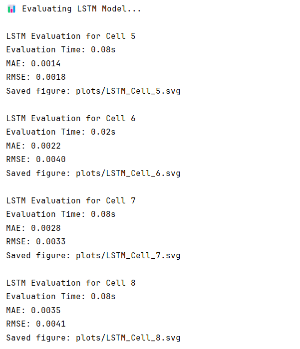
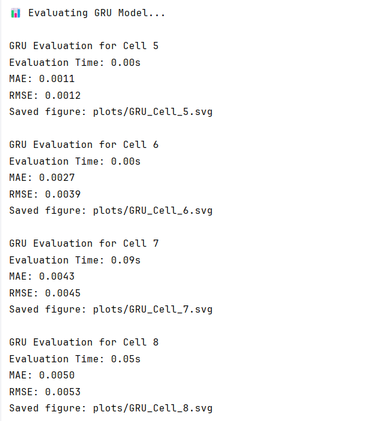

# Battery State of Health Prediction using Data-Driven Modelling

[](https://opensource.org/licenses/MIT)
[](https://www.python.org/downloads/release/python-3100/)
[](https://pytorch.org/)
[](https://matplotlib.org/)
[](https://numpy.org/)
[](https://pandas.pydata.org/)
[](https://scikit-learn.org/)
[](https://scipy.org/)


**Brief Summary:**  
Predict the State of Health (SOH) of lithium-ion batteries using machine learning and deep learning models, including XGBoost, GRU, and LSTM, with evaluation metrics MAE and RMSE.

## Overview
This project focuses on predicting the degradation and remaining useful life of lithium-ion batteries using historical charge/discharge data. Accurate SOH prediction helps in battery management systems for electric vehicles and renewable energy storage.

The project leverages:
- Classical machine learning (XGBoost)
- Deep learning models (GRU and LSTM) implemented using **Object-Oriented Programming (OOP)**  
to analyze and predict battery health trends over time.

## Problem Statement
Lithium-ion batteries degrade over time due to repeated charging and discharging cycles.  
The goal of this project is to **predict the battery’s State of Health (SOH)** using historical cycling data. This can help in:
- Preventing unexpected battery failures
- Optimizing battery usage
- Extending battery life

## Key Insights
- RNN models (GRU & LSTM) can capture sequential degradation patterns better than XGBoost.
- Hyperparameter tuning (lookback, hidden dimensions, learning rate) significantly improves prediction accuracy.
- The last cycle of the input sequence is crucial for accurate SOH forecasting.

## Dataset
The project uses the [Oxford Battery Degradation Dataset 1](https://ora.ox.ac.uk/objects/uuid:03ba4b01-cfed-46d3-9b1a-7d4a7bdf6fac) [1].:  
- Contains experimental charge/discharge cycles for multiple lithium-ion cells.
- Provides capacity measurements and charge/discharge currents for each cycle.
- Allows modeling of SOH over the battery’s lifetime.

These data are copyright (c) 2017, The Chancellor, Masters and Scholars of the University of Oxford, and the 'Oxford Battery Degradation Dataset 1' researchers. All rights reserved. The dataset is made available under the [Open Database License](http://opendatacommons.org/licenses/odbl/1.0/) with individual contents licensed under the [Database Contents License](http://opendatacommons.org/licenses/dbcl/1.0/).

## Methods
The project follows these steps:

1. **Data Loading & Preprocessing**
   - Load `.mat` files from the Oxford Battery dataset.
   - Interpolate capacity measurements.
   - Normalize data using MinMaxScaler.
   - Create sequences using a lookback window for GRU/LSTM models.

2. **Modeling**
   - **XGBoost**
     - Classical regression on engineered features.
     - Serves as a baseline model.
   - **GRU & LSTM**
     - Sequence-to-one models using PyTorch.
     - Input: sequences of battery data.
     - Output: predicted SOH.


3. **Training**
   - Models trained using Mean Squared Error loss.
   - Hidden states initialized per batch for RNNs.
   - Hyperparameters tuned using grid search (learning rate, hidden size, lookback window).

4. **Evaluation**
   - Metrics:
     - **MAE** – Mean Absolute Error
     - **RMSE** – Root Mean Squared Error
   - Predictions are inverse-scaled to the original SOH range.
   - Visualizations of predicted vs actual SOH over cycles.

## Dashboard / Model / Output
The outputs include:
- Plots comparing **predicted vs actual SOH** for each battery cell.
- Evaluation metrics: **MAE** and **RMSE** for each model.
- Saved PyTorch models for XGBoost, LSTM and GRU:
  - `DT/saved_models/xgb_model`
  - `RNN/LSTM/saved_models/gru_model.pt`
  - `RNN/GRU/saved_models/lstm_model.pt`

## How to Run this Project

1. **Clone the repository**
```bash
git clone <your-repo-url>
cd <repo-folder>
```

2. **Download the dataset**
```bash
a. Visit the [dataset download page](https://ora.ox.ac.uk/objects/uuid:03ba4b01-cfed-46d3-9b1a-7d4a7bdf6fac/files/m5ac36a1e2073852e4f1f7dee647909a7)
b. Download the file `Oxford_Battery_Degradation_Dataset_1.mat`
c. Place the downloaded file in the `./datasets/` directory  
```

3. **Install dependencies**
```bash
pip install -r requirements.txt
```

4. **Geeting intovdesired folders**
```bash
cd DT/ ..
```
or 

```bash
cd RNN/LSTM ..
```

or

``` bash
cd RNN/GRU .. 
```

5. **Run the main script**
```bash
python main.py
```

This will:

- Load and preprocess the data
- Perform hyperparameter tuning
- Train XGBoost, LSTM or GRU models
- Evaluate predictions and metrics
- Plot predicted vs actual SOH

## Results and Performance Evaluation


### 🔹 XGBoost Cell 5


- **RMSE:** ` %`

---

### 🔹 XGBoost Cell 6


- **RMSE:** ` %`

---

### 🔹 XGBoost Cell 7


- **RMSE:** ` %`

---

### 🔹 XGBoost Cell 8


- **RMSE:** ` %`

---

### Overall MSE and RMSE using LSTM Model



---

### Overall MSE and RMSE using GRU Model



---

For plots of cells using deep learning techniques, please refers to `RNN/LSTM/plots` and `RNN/GRU/plots`

## Conclusion

- The project successfully predicts battery SOH using sequential models and classical ML.
- GRU and LSTM capture temporal dependencies better than XGBoost, resulting in lower MAE/RMSE.
- Provides a framework for battery health monitoring and predictive maintenance.

## Credits

This project uses the following open source libraries and frameworks:

- **[PyTorch](https://pytorch.org/)** – Deep learning framework for implementing LSTM and GRU models  
- **[XGBoost](https://xgboost.ai/)** – Gradient boosting framework used for machine learning model development  
- **[NumPy](https://numpy.org/)** – Numerical computing and array operations  
- **[Pandas](https://pandas.pydata.org/)** – Data manipulation and preprocessing  
- **[Matplotlib](https://matplotlib.org/)** – Plotting and visualization of SOH trends  
- **[Scikit-learn](https://scikit-learn.org/)** – Preprocessing, scaling, and XGBoost utilities  
- **[SciPy](https://scipy.org/)** – Loading MATLAB `.mat` files and scientific computing

## Future Work

- Incorporate additional features (temperature, voltage, current profiles).
- Deploy a real-time battery health monitoring system.
- Explore advanced architectures like Transformer-based time series models.
- Optimize for GPU for faster training on large datasets.

### References

[1] Christoph R. Birkl, "Diagnosis and Prognosis of Degradation in Lithium-Ion Batteries", PhD thesis, Department of Engineering Science, University of Oxford, 2017.

[2] Zihao Liu, "NRP_2022_EEE12", University of Cambridge, 2022.
